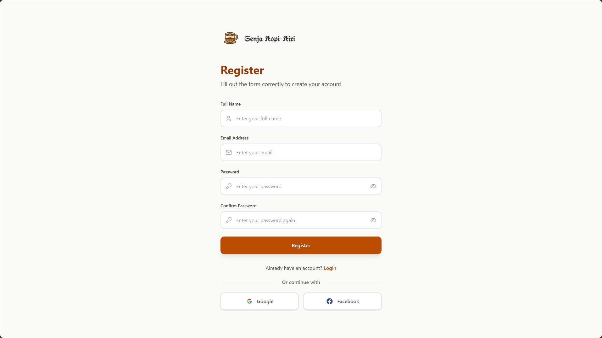
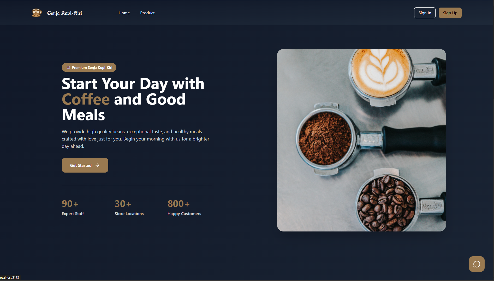
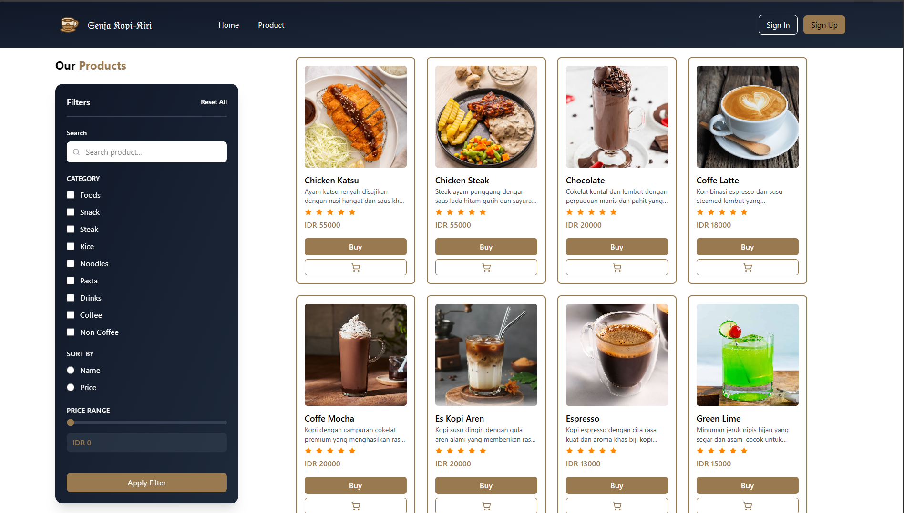
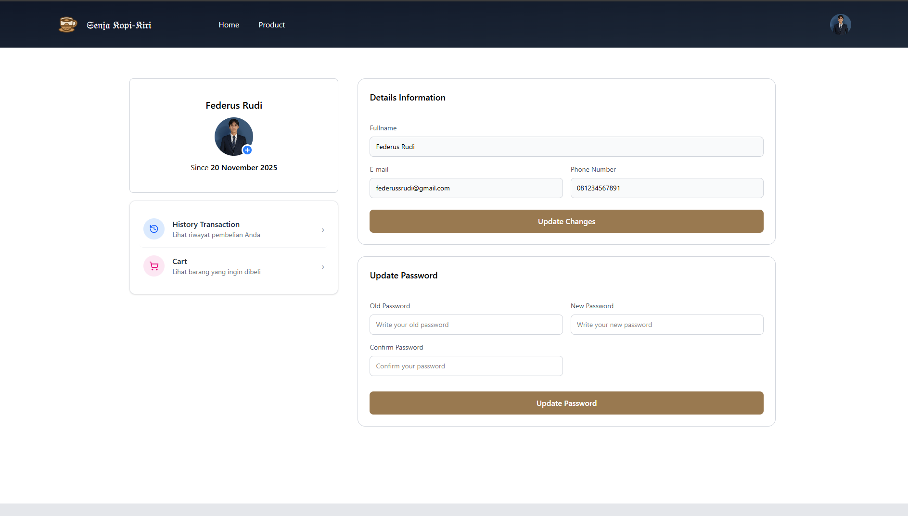

#  ☕ Coffee Shop Senja Kopi Kiri
> The Senja Kopi Kiri app allows users to order coffee products directly through the app, from adding products to their cart, making payments using available payment methods, to viewing their order history and details. Users can also update information on their profile page for a more personalized and flexible experience. Furthermore, the app supports a forgot password feature, where users can request a password reset and receive a token via their registered email. The system has two roles: user and admin, with the admin responsible for managing the categories and products available in the app.


## 📸 Preview
| Register | Home Page |
|---------|-----------|
|  |  |

| List Product | Profile |
|--------------|---------|
|  |  |

<br>

🚀 Features
- 🔐 Authentication (Login & Register)
- 🔑 Forgot Password via Email Token
- 🛒 Order Management (Add to Cart, Checkout, Payment)
- 🧾 View Order History & Order Details
- 👤 User Profile Management (Update Personal Information)
- 🛠️ Admin Management for Categories & Products
- ✨ Multiple File Upload (e.g., product images)
- 👤 Role-Based Authentication & Authorization (User & Admin)

<br>

## 🛠️ Tech Stack


<br>

##  🔐 .env Configuration
```
VITE_BASE_URL=<url_backend>
```
## 📦 How to Install & Run Project
### 1. First, clone this repository: 
```
https://github.com/federus1105/koda-b4-backend.git
```
### 2. Install Dependencies
```npm
npm i
```
### 3. Setup your environment
### 4. Run Server/Project
```
npm run dev
```
### 5. Open In Browser
```
http://localhost:5173
```

### BACKEND SENJA KOPI-KIRI
🛠️ [Backend API](https://github.com/federus1105/koda-b4-backend.git)  
<br>
## 👨‍💻 Made with by
📫 [federusrudi@gmail.com](mailto:federusrudi@gmail.com)  
💼 [LinkedIn](https://www.linkedin.com/in/federus-rudi/)  

## 📜 License
Released under the **MIT License**.  
You’re free to use, modify, and distribute this project — just don’t forget to give a little credit

[](LICENSE)
